<p align="center">
  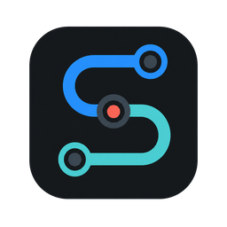
</p>

<h1 align="center">ShowNet</h1>

<p align="center">
  <a href="./README.md">简体中文</a> · <strong>English</strong>
</p>

<p align="center">Login works in your system browser — then capture breaks it?<br />You can see the request, but replay never goes out?<br />ShowNet keeps traffic, certificates, fingerprints, and AI analysis on one local path so the protocol actually runs.</p>

<p align="center">
  <a href="https://github.com/suifei/shownet/releases/latest">Download</a> ·
  <a href="#ten-minutes-to-first-traffic">Get started</a> ·
  <a href="#ai-endpoint-and-support">AI endpoint</a> ·
  <a href="#contact">Contact</a>
</p>

<p align="center">
  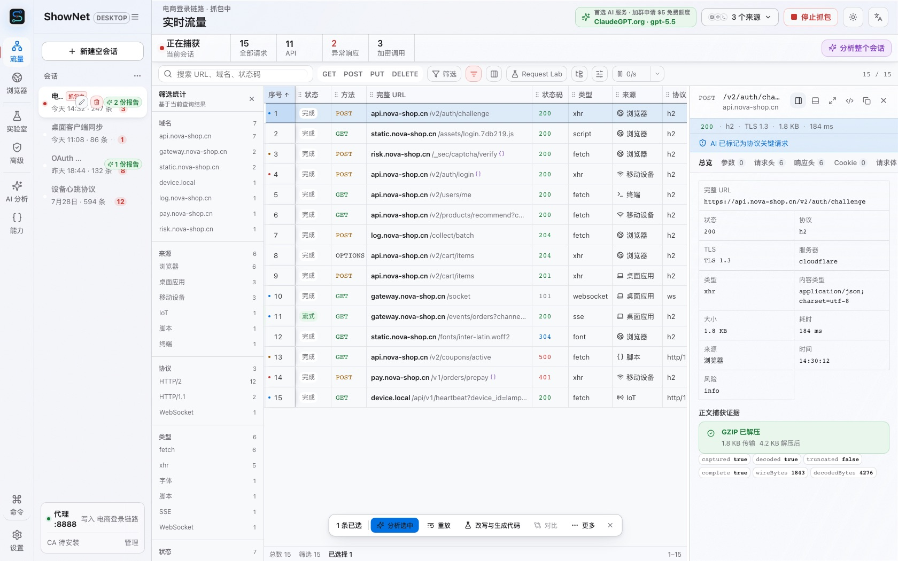
</p>

Current release: [v0.4.32](https://github.com/suifei/shownet/releases/tag/v0.4.32). For a finer map of what is in and out of scope, see the [feature overview](docs/feature-map.md) (Chinese).

The [Chinese README](./README.md) is the default GitHub homepage. This English page is the same product story for a global audience.

## What it actually fixes

There are many capture tools. The pain is rarely “can I see an HTTP request”. It is that you still cannot reconstruct the protocol after you have seen it.

- **Login is fine in the system browser, then dies as soon as a proxy is on.** Origins look at the TLS fingerprint, whether cookies were split, whether language headers were duplicated, and whether egress still looks headless. ShowNet puts embedded Chrome, MITM, and a Chrome-aligned outbound handshake into the same session.
- **The list has the request. Your own replay is always 403.** Signatures are often computed in page scripts: timestamps, challenges, HMAC, Chinese national crypto. ShowNet can keep hooks and code snippets in request order, then let AI write checkable steps from that evidence only.
- **A phone app only shows CONNECT, never the body.** Install the CA on this machine in one click, or let a device scan a page that ships both the certificate and the proxy settings. Certificate-pinned apps still only expose metadata — the product will not pretend it decrypted them.
- **After analysis you still hand-write a client.** From confirmed requests, export an algorithm-replay pack and callable code. Unconfirmed parts go into gaps instead of a signature that only looks runnable.

The product rule is short: **capture works out of the box, evidence can be reviewed, conclusions can be reproduced.** TLS decryption stays on. There is no site whitelist. A JA4 target in settings is never reported as “this handshake already matches”.

<p align="center">
  
</p>

## Real scenarios

These use “a certain site / a certain app” on purpose. They talk about the technical point, not a named target. Pictures in this section are scene illustrations, not product screenshots. The matching UI is in [Ten minutes to first traffic](#ten-minutes-to-first-traffic).

### 1. A certain site: QR login succeeds, then the callback drops you back on the login page

**Technical point:** cookies split across headers on HTTP/2, outbound JA4 not matching the browser, duplicated `Accept-Language` weights, or a page hook rewriting `fetch` / SubtleCrypto.

**What it feels like:** the system browser passes once; in the capture session the challenge succeeds but the cookie is gone, or the origin refuses the handshake outright.

**What ShowNet does:** page hooks are off by default; cookie crumbs are reassembled before they go upstream; the release build uses Chrome-aligned egress. The fingerprint panel only says “match” when **that connection was measured**. A preset target is not treated as evidence.

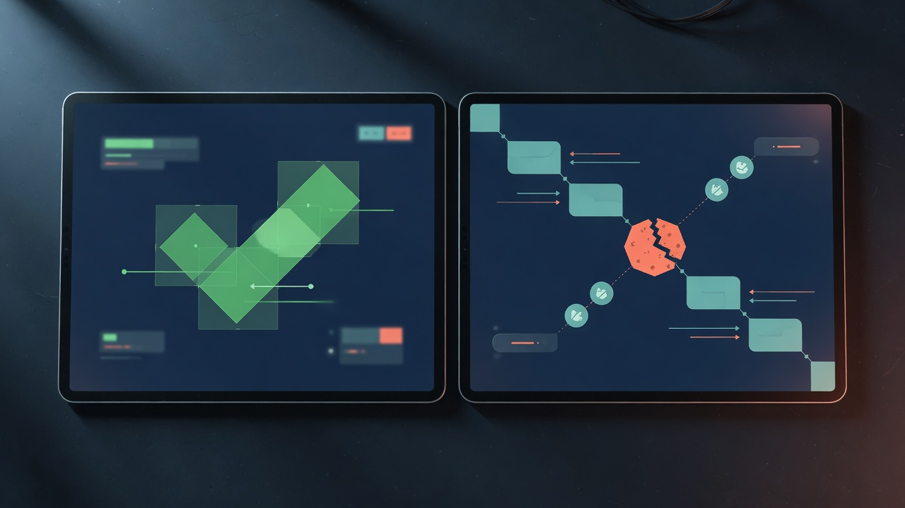

### 2. A certain app: the computer sees metadata; phone HTTPS is garbage or blank

**Technical point:** the device does not trust the local Root CA, the proxy is not pointed at `8888`, or the app pins certificates.

**What it feels like:** you only see CONNECT, never JSON; or you installed someone else’s certificate and the private key is sitting on the desktop.

**What ShowNet does:** every install ships its own Root CA. The private key is encrypted in the local store. One click writes it into this user’s trust store; the phone scan page gives both the certificate and the Wi‑Fi proxy settings. Android can push a user certificate from the computer, **no Root required**. Certificate-pinned apps stay metadata-only. The product will not fake a successful decrypt.

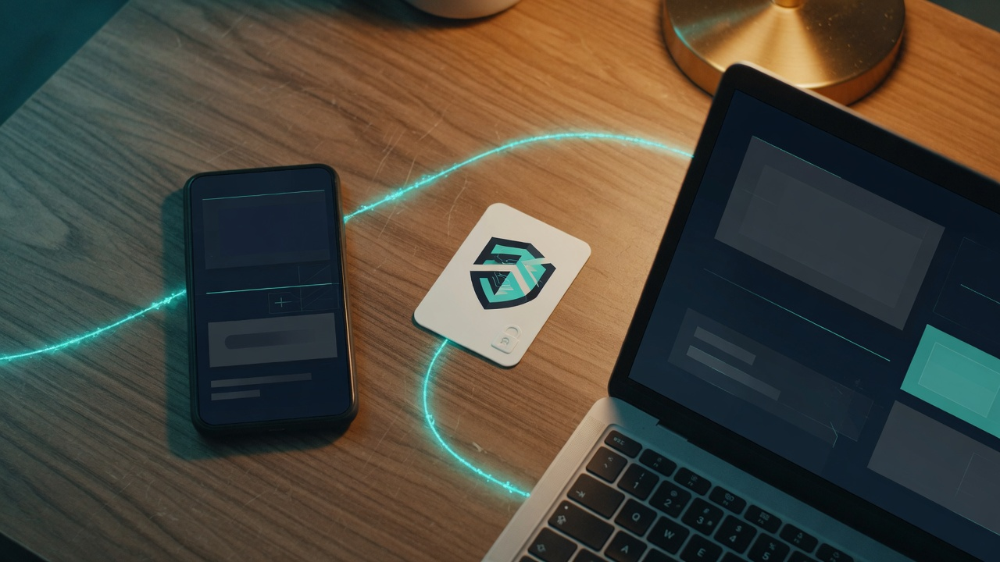

### 3. A certain API: you understand the body, the signature never matches

**Technical point:** dynamic `sign` / `token`, Web Crypto, CryptoJS, SM-series, challenge scripts. Fields change every time. Exporting a HAR does not make it callable.

**What it feels like:** you copy the headers and send again; the origin says the signature is illegal. You cannot tell which step consumed a challenge from an earlier response.

**What ShowNet does:** turn JS hooks on only when you need them, then align crypto calls with proxied requests by time. AI analysis reads only the current session. A report must link back to `#N` requests. Algorithm replay writes only steps that **ran against captured ground truth**. Things that were recognized but not reproduced are listed by name only.

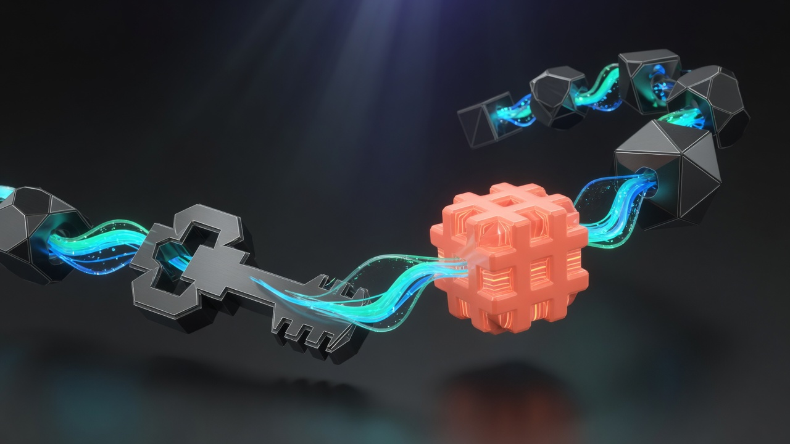

### 4. A certain backend: you captured all afternoon and still have to write a client by hand

**Technical point:** the same resource with different IDs, a token from login reused later, gzip/br bodies, callers in more than one language.

**What it feels like:** the export is a pile of URLs, not `get_user(id)`. Bake credentials into the repo and they leak; leave them out and the client will not run.

**What ShowNet does:** fold samples into endpoints. Captured credentials become constructor arguments, not hardcoded secrets. If a login path can be inferred, it generates `authenticate_*()`. Gaps go into `GAPS.md`. Request Lab can also emit Python / JS / Go / cURL directly.

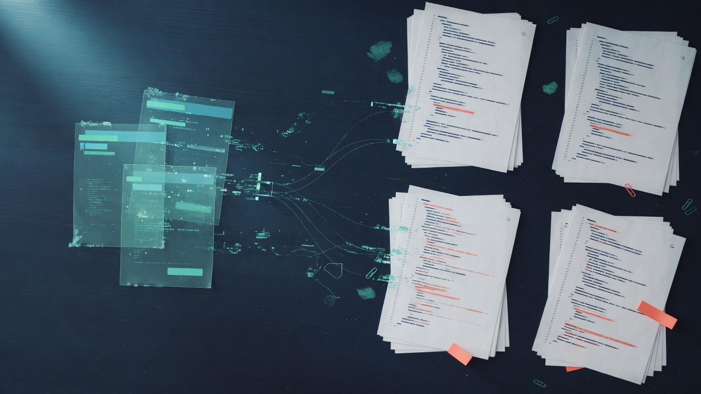

## Ten minutes to first traffic

Do these in order. **Step 1 shows traffic without installing a certificate.**

### 1. Zero config: start capture in the embedded browser (no CA first)

Open the app → **Browser** → **Start capture** → open the target page. Requests land in the current session and are clickable immediately. Page hooks stay off by default, so login and payment use native Chrome APIs.

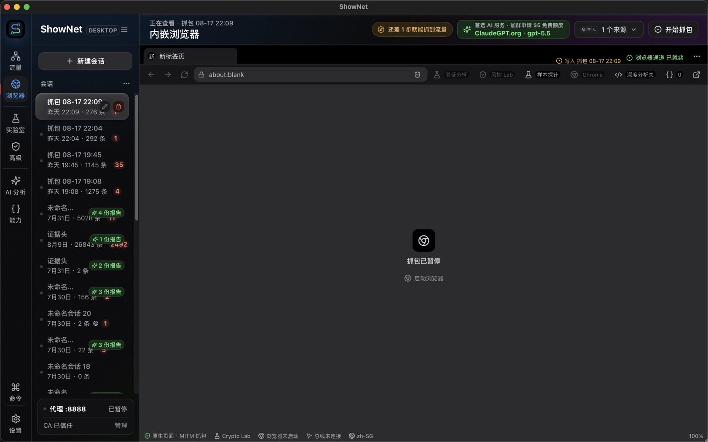

### 2. Install the CA only when you need to decrypt app / system HTTPS

In Settings, “Install CA” writes the trust store on this machine. Phones use the scan page. The proxy listen address defaults to `127.0.0.1:8888`. If that fails, export DER/PEM and install it by hand.

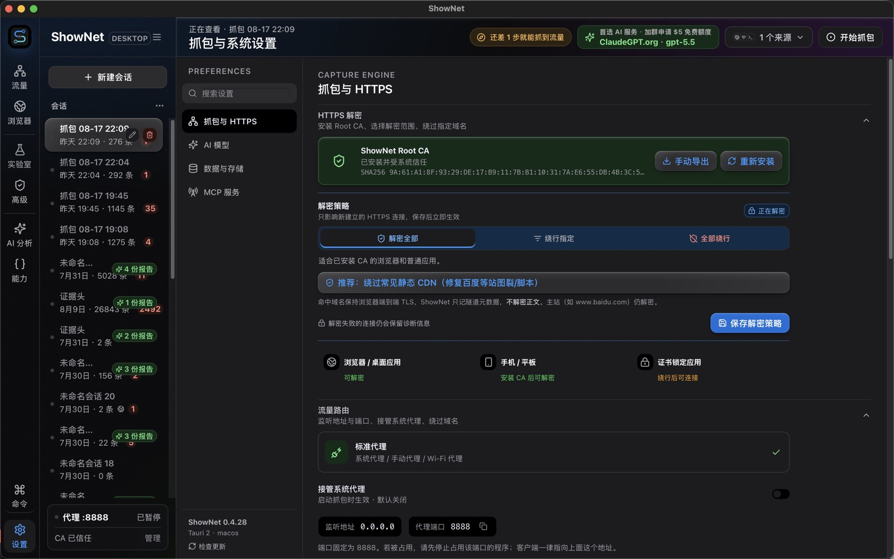

### 3. Let AI explain the session

Pick auto / API / security / performance / JS crypto. The agent reads only this session. On failure it shows the model’s error code (not just 502). You can edit the last prompt and retry, or continue on a local model.

<p align="center">
  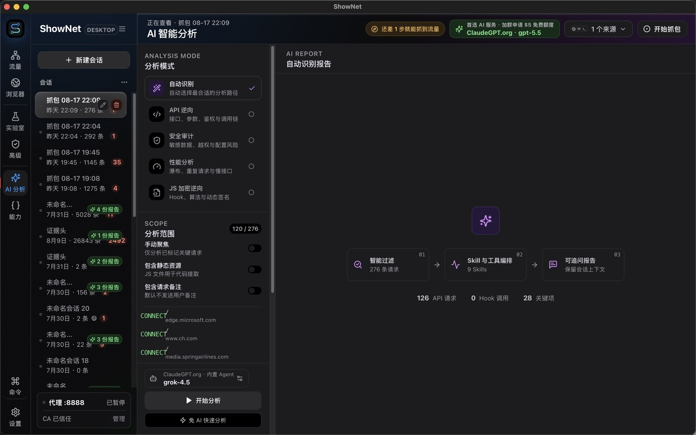
</p>

The next seven frames are a real pass through the shipping UI — pick a mode, get a report, then Graph / Skill / console / lab / traffic (loops):

<p align="center">
  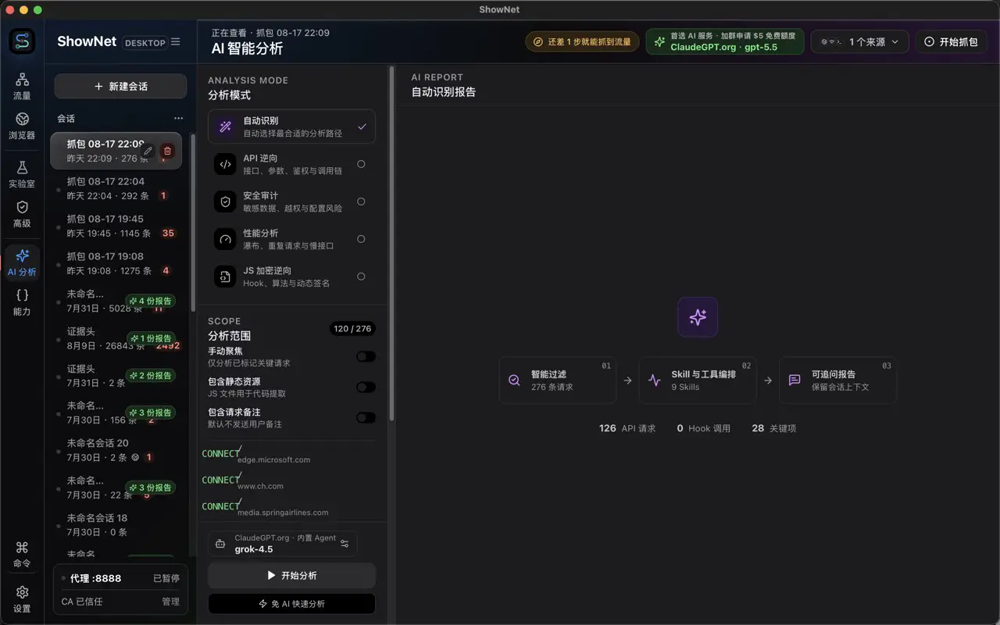
</p>

<p align="center">
  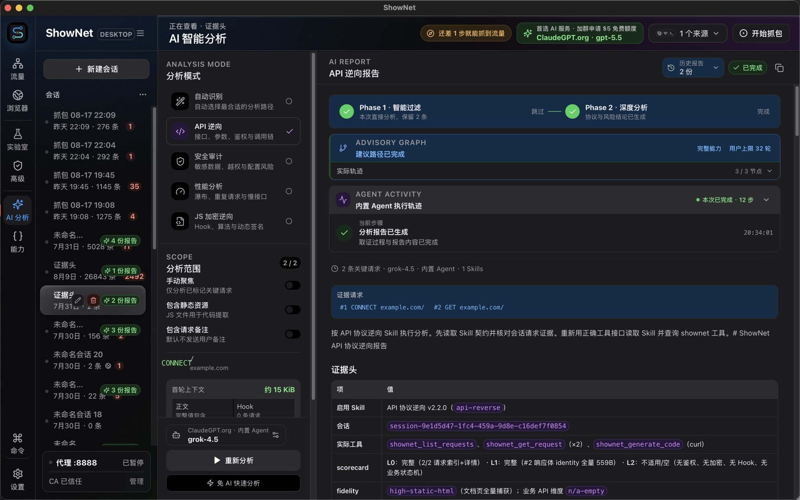
</p>

<p align="center">
  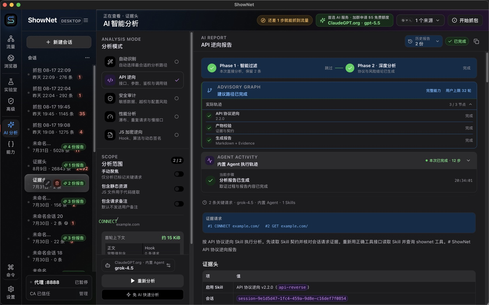
</p>

### 4. Export algorithm replay or client code from the report

An analysis report can export an algorithm-replay pack. Traffic or a collection can go into Request Lab to generate code. Unconfirmed steps are marked.

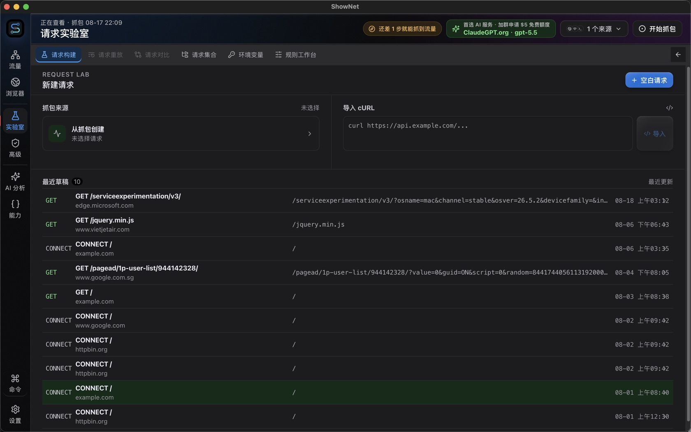

Fuller capability map: [feature overview and workflow](docs/feature-map.md) (Chinese). TLS presets and the console: [ClientHello notes](docs/clienthello-catalog-and-mitm-console.md) (Chinese).

## Install

Download from [Releases](https://github.com/suifei/shownet/releases/latest):

| Platform | File |
|------|------|
| macOS (Apple Silicon) | `ShowNet_<version>_aarch64.dmg` |
| Windows (x64) | `ShowNetPortable_<version>_windows_x86_64.zip` |

Current release builds are **not commercially code-signed**. The first open will be blocked once by the OS. Check the attached `SHA256SUMS.txt` first.

```bash
# macOS / Linux
grep ShowNet_<version>_aarch64.dmg SHA256SUMS.txt | shasum -a 256 -c -
```

```powershell
# Windows
(Get-FileHash ShowNetPortable_<version>_windows_x86_64.zip -Algorithm SHA256).Hash
```

**macOS:** drag into Applications, then **right-click ShowNet.app → Open**, and click Open again. If macOS says the app is damaged:

```bash
xattr -dr com.apple.quarantine /Applications/ShowNet.app
```

**Windows:** run `ShowNetPortable.exe`. In SmartScreen choose “More info” → “Run anyway”. The portable build does not write the registry.

## AI endpoint and support

Analysis needs an OpenAI-compatible endpoint. The in-app recommendation:

| Item | Value |
|----|----|
| Service | [ClaudeGPT](https://claudegpt.org/) (OpenAI-compatible) |
| Base URL | `https://claudegpt.org/v1` |
| Default model | `gpt-5.5` |
| Free credit | Join the QQ group, then ask an admin for a one-time $5 credit |

You can also switch to another compatible vendor, or a local `http://127.0.0.1:11434/v1` (Ollama / LM Studio). API keys are stored encrypted on this machine.

**System Grok (optional).** ShowNet does not bundle Grok. Settings → AI → Agent runtime: refresh to detect first; only then use the official installer if nothing is found.

| Platform | Official installer | Default location |
|------|------------|----------|
| macOS / Linux | [install.sh](https://x.ai/cli/install.sh) | `~/.grok/bin/grok` |
| Windows | [install.ps1](https://x.ai/cli/install.ps1) | `%USERPROFILE%\.grok\bin\grok.exe` |

Install is direct by default. Only if direct download fails should you configure a **ShowNet upstream proxy** under “Upstream proxy and TLS fingerprint” (that is not listen port `8888`, and not the system `HTTP_PROXY`). The official Windows installer does not support SOCKS5. ShowNet’s endpoint, key, skills, and MCP are injected only into this Agent process. They do not change Grok’s global config.

## Contact

For the free credit and usage questions, join QQ group **553354813**, then message an admin.

<p>
  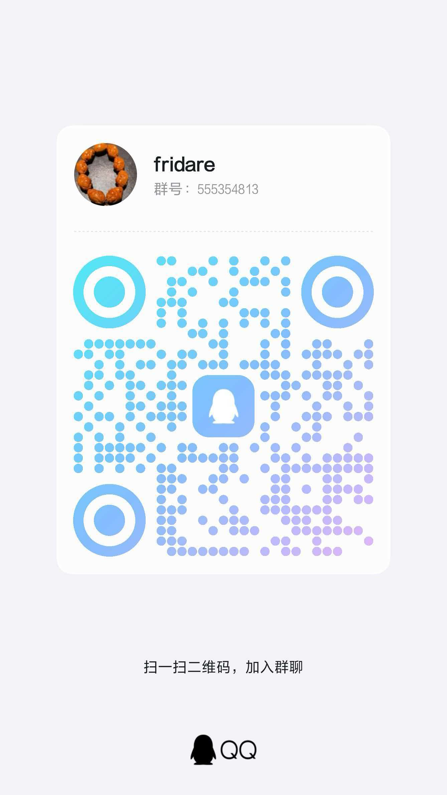
</p>

Service site: [claudegpt.org](https://claudegpt.org/)

## Tutorial videos

Narration on these two files is Chinese. The UI path they walk is the same as [Ten minutes to first traffic](#ten-minutes-to-first-traffic).

<table>
  <tr>
    <td width="50%" valign="top">
      <a href="docs/assets/tutorial/ShowNet-真实操作新手教程-B站横版.mp4">
        
      </a>
      <br />
      <strong>Landscape</strong><br />
      <a href="docs/assets/tutorial/ShowNet-真实操作新手教程-B站横版.mp4">Play MP4</a> ·
      <a href="docs/assets/tutorial/ShowNet-真实操作新手教程.srt">Chinese captions</a>
    </td>
    <td width="50%" valign="top">
      <a href="docs/assets/tutorial/ShowNet-真实操作新手教程-小红书竖版.mp4">
        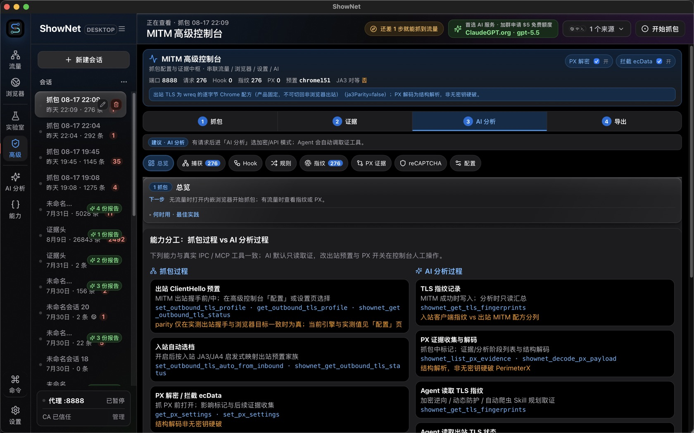
      </a>
      <br />
      <strong>Portrait</strong><br />
      <a href="docs/assets/tutorial/ShowNet-真实操作新手教程-小红书竖版.mp4">Play MP4</a> ·
      <a href="docs/assets/tutorial/ShowNet-真实操作新手教程.srt">Chinese captions</a>
    </td>
  </tr>
</table>

## Develop

```bash
npm install
npm run dev
npm run build
npm run tauri dev
```

Network-related integration tests are ignored by default: `npm run test:rust:network`.

## Honesty bounds

- Release egress uses a wreq Chrome profile. ShowNet **does not claim** a bit-level browser JA3 clone. JA3 includes GREASE, so one page load can measure several different JA3 values. Comparisons use JA4.
- WebSocket egress uses the same wreq Chrome TLS profile as HTTPS. wreq performs the Upgrade; ShowNet still relays and stores frames. This is not a bit-level JA3 clone.
- Certificate pinning, TUN transparent capture, and store-grade signed installers are still later work.

## License

Copyright (C) 2026 ShowNet contributors.

ShowNet is free software licensed under the [GNU General Public License version 3](LICENSE) (`GPL-3.0-only`). Optional Agent notices: [THIRD_PARTY_NOTICES.md](THIRD_PARTY_NOTICES.md).
