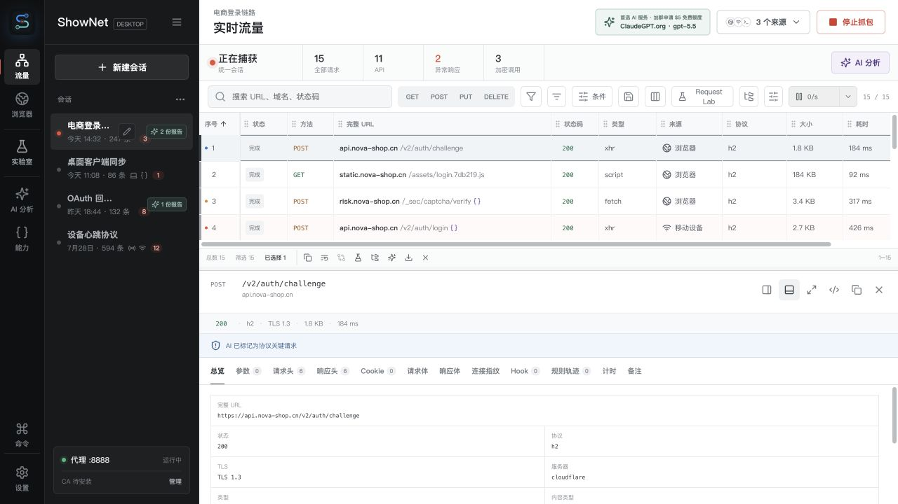

<p align="center">
  
</p>

<h1 align="center">ShowNet</h1>

ShowNet 是面向开发者的 AI 原生抓包、协议分析与请求调试桌面工具。浏览器、桌面程序、终端、脚本和移动设备的流量会汇总到同一个会话；从一条请求开始，可以检查完整证据、交给 AI Agent 分析、进入 Request Lab 重放，最后直接生成可运行的调用代码。

> 第一次使用不必配置系统代理或证书：打开内嵌浏览器后点击“开始抓包”，浏览器流量会自动进入当前会话。需要抓取手机或其他软件时，再按应用内的设备引导安装证书并连接代理。

## 先看教程

<table>
  <tr>
    <td width="50%" valign="top">
      <a href="docs/assets/tutorial/ShowNet-真实操作新手教程-B站横版.mp4">
        
      </a>
      <br />
      <strong>横版完整教程（Bilibili）</strong><br />
      <sub>2 分钟，从开始抓包到 AI 分析、请求重放和代码生成。</sub><br />
      <a href="docs/assets/tutorial/ShowNet-真实操作新手教程-B站横版.mp4">播放 MP4</a> · <a href="docs/assets/tutorial/ShowNet-真实操作新手教程.srt">中文字幕</a>
    </td>
    <td width="50%" valign="top">
      <a href="docs/assets/tutorial/ShowNet-真实操作新手教程-小红书竖版.mp4">
        
      </a>
      <br />
      <strong>竖版教程（小红书）</strong><br />
      <sub>适合手机观看的同一套真实操作流程。</sub><br />
      <a href="docs/assets/tutorial/ShowNet-真实操作新手教程-小红书竖版.mp4">播放 MP4</a> · <a href="docs/assets/tutorial/ShowNet-真实操作新手教程.srt">中文字幕</a>
    </td>
  </tr>
</table>

## 五步上手

### 1. 打开内嵌浏览器，开始抓包

进入“浏览器”，打开要测试的网站，点击右上角“开始抓包”。内嵌浏览器的请求和 JS Hook 证据会自动关联，不需要先折腾代理配置。


### 2. 在统一会话里定位请求

回到“流量”，所有来源的请求都会按时间进入当前会话。先用 URL、域名、状态码或关键字过滤，例如搜索 `login`，再打开最相关的一条。


### 3. 查看请求和响应的完整证据

在详情页检查 URL、方法、状态码、协议、请求头、Cookie、正文、响应、耗时，以及捕获到的 Hook 关联。这里是后续判断和复现的事实依据。


### 4. 让 AI Agent 建立证据链

在“AI 分析”中选择分析模式并限定范围。Agent 会先确认范围，再关联调用链、核验请求证据并输出报告；报告中的结论仍然可以回到原始流量逐条验证。


### 5. 在 Request Lab 重放，并生成调用代码

选中请求后直接进入“请求实验室”。方法、URL、Header、Cookie、认证和正文会带入草稿；可以修改后重放，也可以点“生成代码”，从下拉框选择 Python、Java、JavaScript、TypeScript、Go 或 cURL。


## 功能总览

<table>
  <tr>
    <td width="50%" valign="top">
      
      <br />
      <strong>Traffic Evidence Workbench</strong><br />
      <sub>Scan dense sessions, follow a request into structured request/response evidence, and keep protocol details in one investigation surface.</sub>
    </td>
    <td width="50%" valign="top">
      
      <br />
      <strong>Browser and Hook Correlation</strong><br />
      <sub>Drive an isolated browser while ordered Hook events, cryptographic calls, and proxy requests stay visibly connected.</sub>
    </td>
  </tr>
  <tr>
    <td width="50%" valign="top">
      
      <br />
      <strong>Auditable AI Analysis</strong><br />
      <sub>Turn selected traffic into a focused protocol report with risk markers, execution activity, and evidence backlinks.</sub>
    </td>
    <td width="50%" valign="top">
      
      <br />
      <strong>Unified Multi-source Capture</strong><br />
      <sub>Bring browser, desktop, terminal, script, mobile, and IoT traffic into one local-first ordered Session.</sub>
    </td>
  </tr>
</table>

<p><sub>Product workflow visuals generated for the project README. Interface details may evolve as the desktop implementation advances.</sub></p>

## Product Surface

- Unified sessions for browser, desktop, terminal, scripts, mobile, and IoT traffic
- Actionable source onboarding with live proxy addresses, copyable shell configuration, Python/Node.js/Go templates, browser launch, and private-LAN device setup
- Explicit HTTP proxy on `127.0.0.1:8888` by default, with opt-in private-LAN listening for mobile/IoT and direct, HTTP, HTTPS, and SOCKS5 egress routes
- Per-installation Root CA with encrypted SQLite private-key persistence and cached host certificates
- Device onboarding QR backed by a private-LAN setup page and DER/PEM Root CA downloads served directly by the capture listener
- HTTPS HTTP/1.1 and HTTP/2 MITM capture with verified upstream TLS, inbound JA3/JA4 plus HTTP/2 SETTINGS/window/priority metadata, and bounded gzip/Brotli/deflate/zstd response normalization
- First-class WebSocket and Server-Sent Events evidence: ordered bounded capture, live SSE parsing before the connection closes, searchable inspectors, stream completeness markers, and full-value Agent/MCP read tools
- Dense request table with source, risk, Hook, request/response, and timing details
- Browser workspace that launches an isolated proxy Chrome, injects Hooks before page scripts through CDP, correlates live Hook events with proxy requests, supports native text clipboard and IME composition bridging, and can run the bundled crypto Lab directly into Agent analysis
- Tree-sitter JavaScript extraction for Web Crypto, CryptoJS, SM2/3/4, and dynamic-signature code, with bounded snippets that preserve captured values
- Two-stage analysis: relevance filtering, then focused protocol analysis
- Automatic, API reverse engineering, security, performance, and crypto modes
- Built-in Skill catalog including dynamic signature adapters
- ShowNet MCP server plus explicitly enabled external Streamable HTTP MCP connections whose namespaced tools join the built-in Agent
- Full-capability official `xai-org/grok-build` headless runtime, pinned and reproducibly built as a Tauri sidecar, with advisory Skill/Graph guidance and user-controlled turn limits
- Lossless request collection import from browser HAR, Postman 2.x, Insomnia, OpenAPI/Swagger, ShowNet JSON, and pasted cURL, plus ShowNet/Postman export preserving credentials, file paths, disabled Header/Query/body-field values and state, settings, tags, portable environment values (including Secrets), and collection source metadata; imported Auth and Secrets are encrypted locally
- macOS and Windows desktop packaging through Tauri 2

## Capture Decision

ShowNet uses a hybrid design:

1. The local MITM proxy on `127.0.0.1:8888` is the primary HTTP(S) capture engine. Device access is opt-in: ShowNet then binds `0.0.0.0:8888`, advertises a detected private address and QR onboarding URL, and rejects non-loopback, non-private, and non-link-local clients. The listener serves its setup page and public CA only when the request Host matches the connection's local ShowNet address.
2. A locally generated ShowNet root CA enables TLS interception for clients that trust it.
3. Explicit system-proxy takeover is opt-in and is restored when capture stops or ShowNet exits. An encrypted recovery journal protects crash recovery.
4. Optional TUN routing is a future layer for apps that ignore proxy configuration. The renderer exposes transparent mode only when the native runtime reports that a supported driver is available.
5. TUN does not decrypt HTTPS. TLS still terminates at the MITM layer.
6. Certificate-pinned clients expose connection metadata only unless the client is instrumented in an authorized test environment.
7. Traffic can leave through a configured HTTP, HTTPS, or SOCKS5 upstream proxy; local targets and ShowNet's own listener always bypass upstream routing.

## Development

```bash
npm install
npm run dev
```

Frontend production build:

```bash
npm run build
```

The local-socket integration tests are ignored by the default Rust suite so restricted development sandboxes can still run unit tests. Run them explicitly on a normal host with:

```bash
npm run test:rust:network
```

The macOS and Windows quality jobs always run this network suite before compiling the desktop executable. It includes a single-session proxy pass covering browser, desktop, terminal, script, mobile, and IoT source classification. Two additional ignored smoke tests require user-provided egress proxies on `127.0.0.1:7890` and `127.0.0.1:7891` and remain manual:

```bash
npm run test:egress
```

This command verifies both upstream tunnels against overseas HTTPS, then starts ShowNet on `127.0.0.1:8888`, trusts only the test CA inside the test client, and confirms MITM capture plus JA3/JA4 metadata through each upstream mode. It never changes the operating-system proxy.

Tauri desktop development requires a Rust toolchain supported by Tauri 2:

```bash
npm run tauri dev
```

The npm Tauri and Rust check scripts resolve both Cargo and Rustc from `rustup stable` before spawning native commands. This keeps local builds deterministic even when Homebrew or another Rust distribution appears earlier in `PATH`.

Release bundles include the pinned built-in Agent sidecar. Its source revision and build toolchain are declared in `third-party/grok-build/SOURCE.json`; build and verify the current host artifact with:

```bash
npm run build:agent-sidecar
npm run check:release -- --require-agent-target aarch64-apple-darwin
npm run test:agent-sidecar
```

Use `x86_64-pc-windows-msvc` for the Windows release runner. The sidecar tests start the real binary against random loopback OpenAI-compatible and MCP endpoints. They verify selected-model routing, environment-only credentials, live output/activity events, runtime-directory cleanup, the `search_tool`/`use_tool` ShowNet evidence loop, the unrestricted default GrokBuild tool surface, and exact forwarding of the user-configured turn limit. The complete upstream Apache-2.0 license and generated dependency notices are bundled with the application.

## Status

The current milestone includes the desktop product shell, SQLite Session/request persistence, ordered CaptureEvents, renderer event streaming, the explicit HTTP/CONNECT proxy, direct/HTTP/HTTPS/SOCKS5 egress routing, Root CA lifecycle, leaf-certificate caching, HTTPS HTTP/1.1 and HTTP/2 application interception, and opt-in macOS/Windows system-proxy takeover with encrypted recovery state. Browser-only development preview uses a mock dataset; the Tauri desktop runtime reads only native persisted data.

The current native milestone includes an in-window browser surface backed by isolated headless Chrome and CDP Screencast, pre-document Hook injection, mouse/keyboard input forwarding, native copy/cut/paste and IME composition bridging, Hook/request correlation, an automated crypto Lab-to-Agent validation flow, HTTP/2 application decoding and connection fingerprinting, compressed-response normalization, AST-based crypto code extraction, versioned dynamic-signature/Akamai replay-harness generation, classic WebSocket upgrade and RFC 8441 extended CONNECT relaying with bounded ordered message capture, first-class SSE streaming requests with incremental event parsing and a full-value Agent evidence tool, OpenAI-compatible two-stage analysis, streaming reports, SQLite-backed live Agent activity that is restored with historical reports, versioned Skill-run audits with permissions/tool calls/status/duration, follow-up chat, evidence-driven built-in Skill planning, bounded local and external MCP Agent tool calls, an isolated pinned headless Agent sidecar with native fallback for development builds, explicit private-LAN device listening, and a loopback-only authenticated MCP Server whose write tools are disabled by default. Optional TUN routing, production-signed installer publication, physical-device end-to-end coverage, and frame-stream accessibility/drag-and-drop parity remain subsequent native milestones. Certificate-pinned clients retain connection/TLS metadata but cannot be transparently decrypted.

## Reference

The module boundaries and two-stage analysis behavior were informed by [`Mouseww/anything-analyzer`](https://github.com/Mouseww/anything-analyzer), adapted for a Tauri backend and multi-source Session model.

## License

Copyright (C) 2026 ShowNet contributors.

ShowNet is free software licensed under the [GNU General Public License version 3](LICENSE) (`GPL-3.0-only`). You may use, study, modify, and redistribute it under those terms. The separately maintained built-in Agent and other bundled dependencies retain the licenses listed in [THIRD_PARTY_NOTICES.md](THIRD_PARTY_NOTICES.md).
