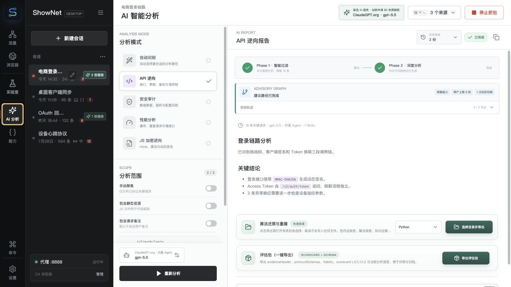
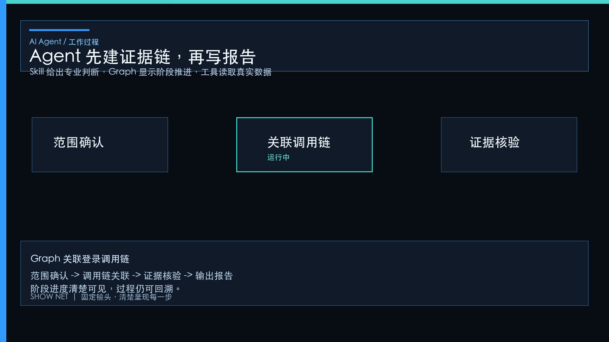
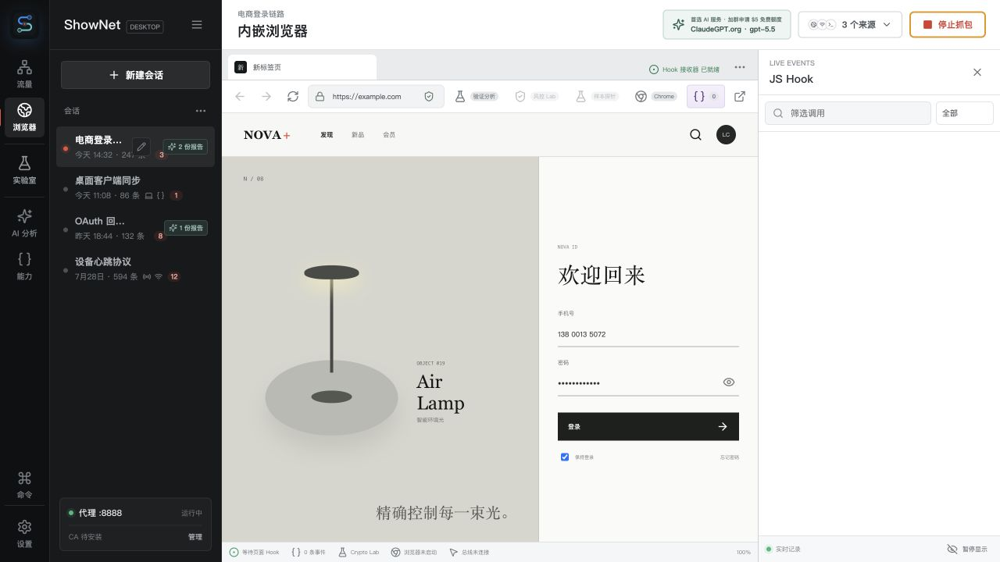
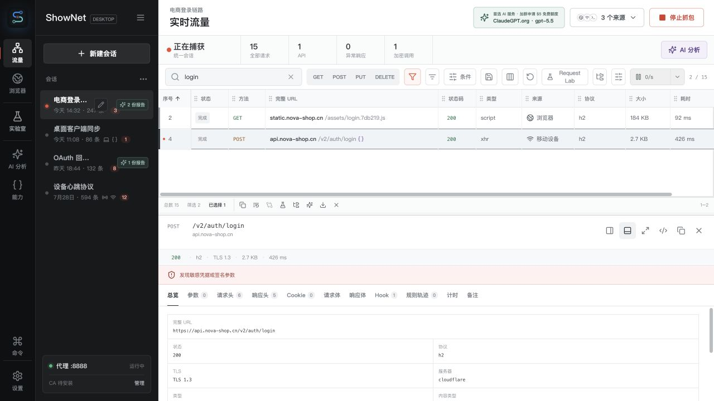
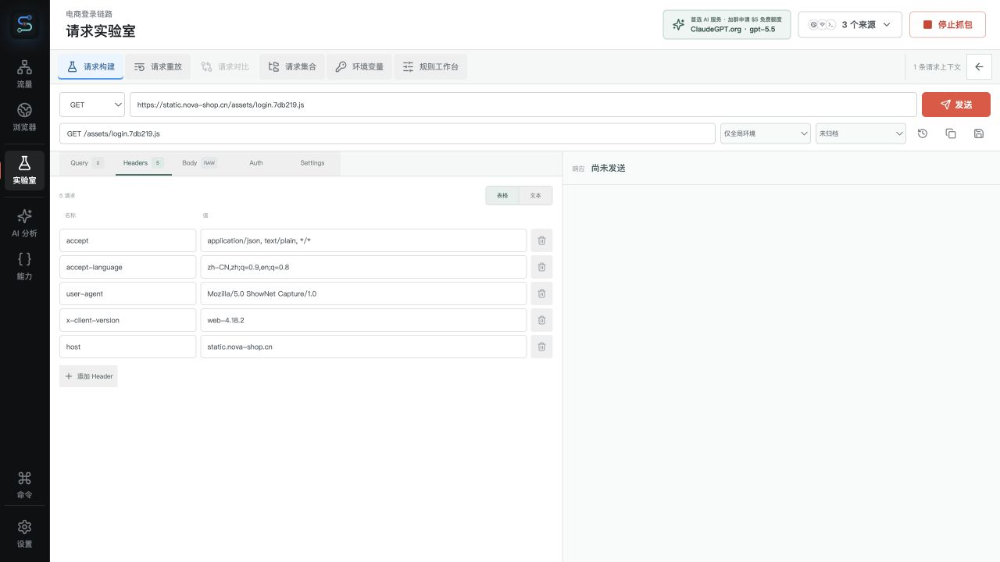
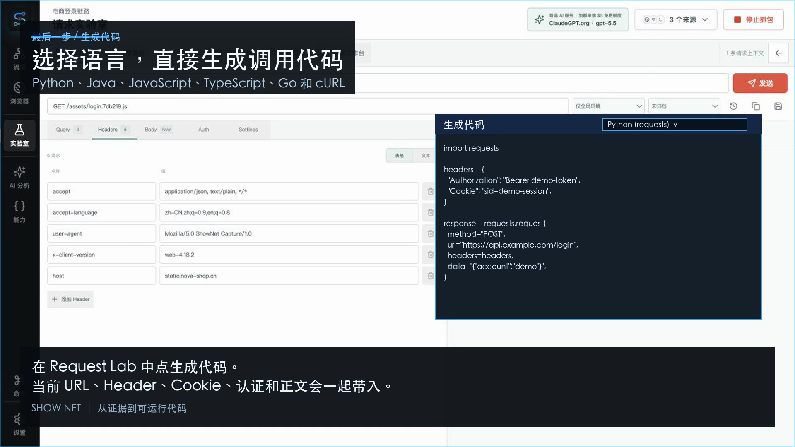
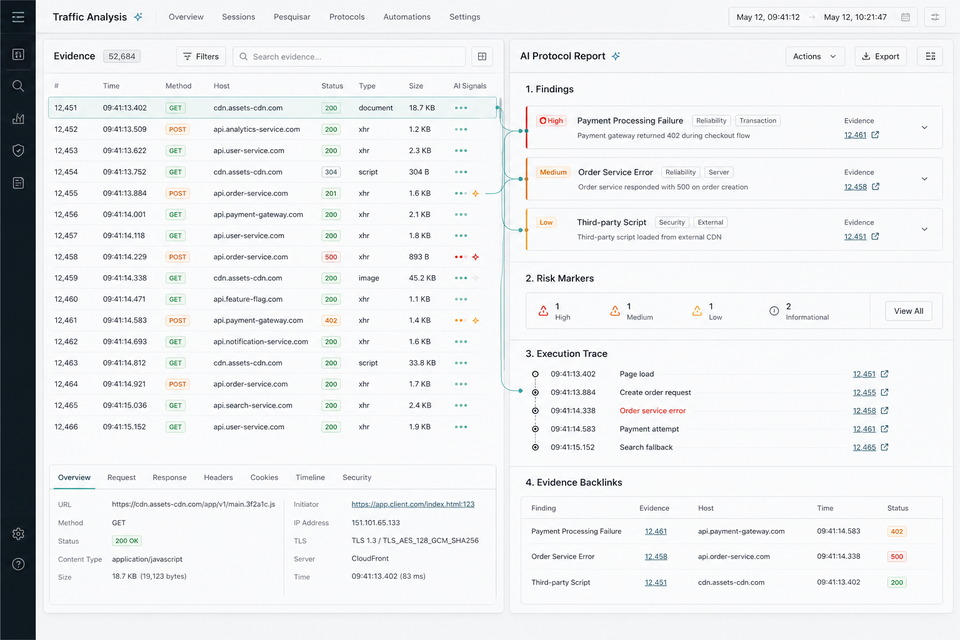
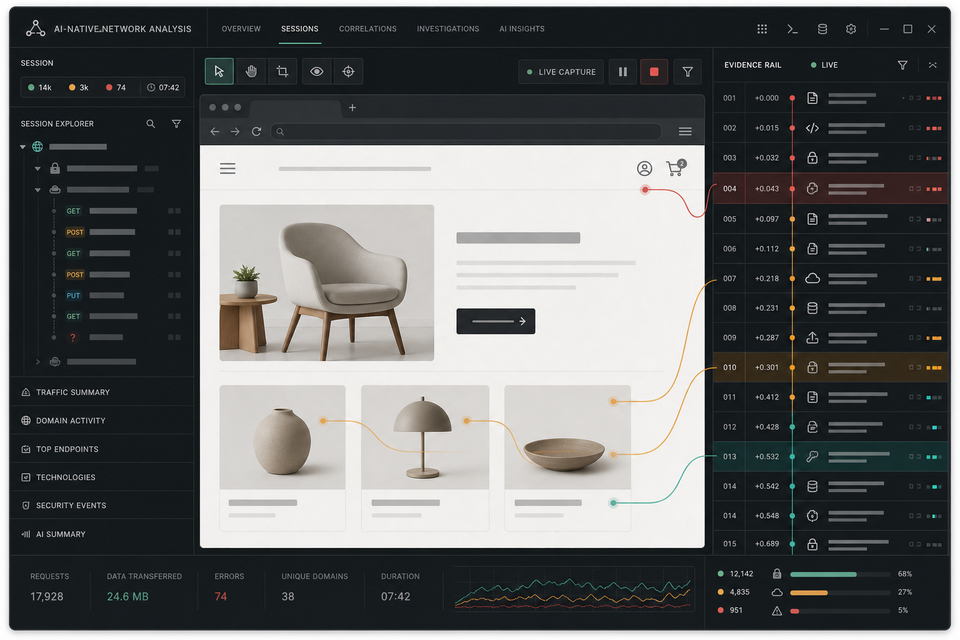
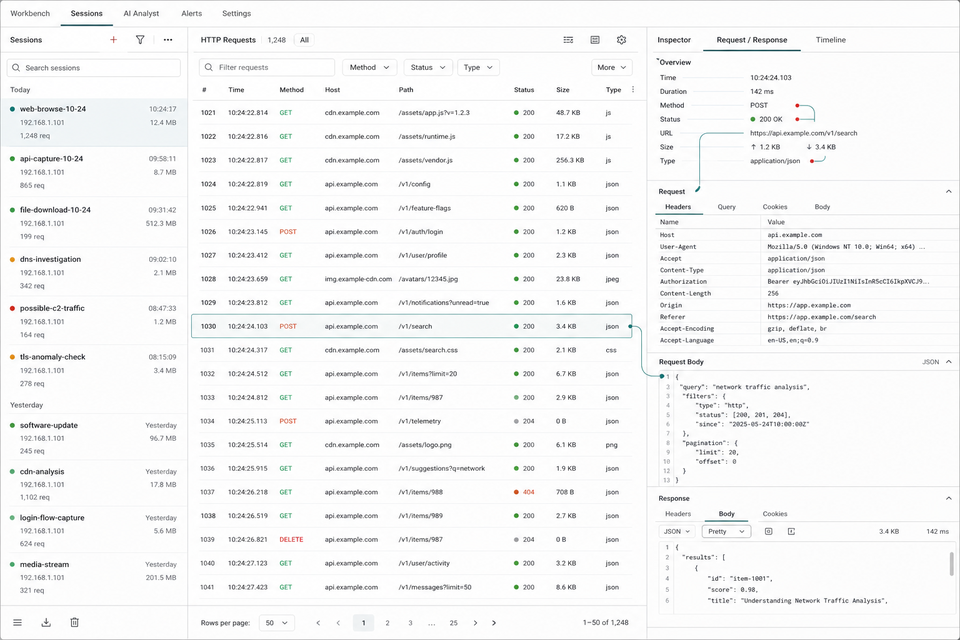
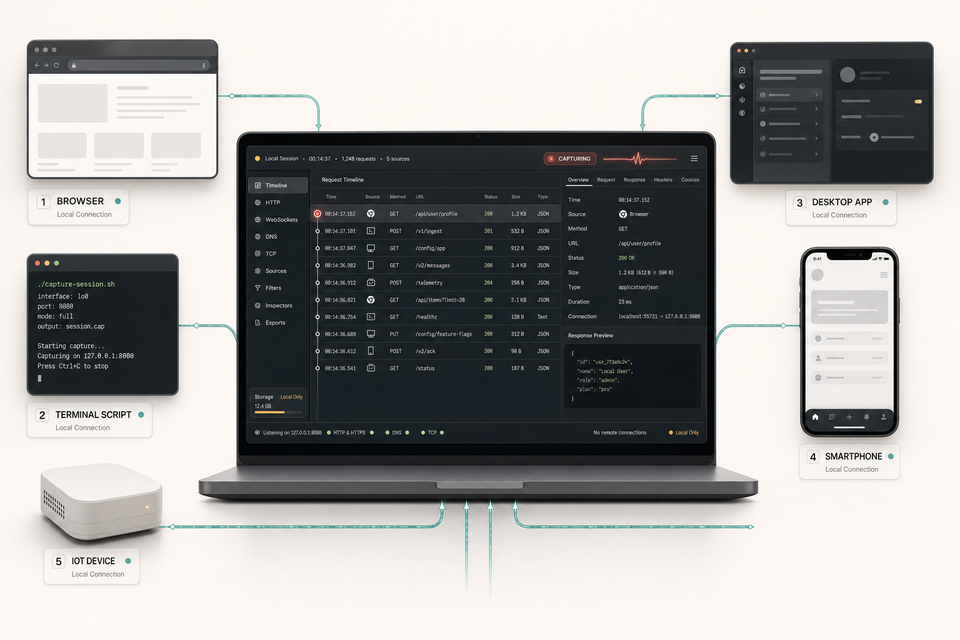

<p align="center">
  
</p>

<h1 align="center">ShowNet</h1>

<p align="center"><strong>AI 原生抓包 · 自动部署数字证书 · 自动协议逆向 · 一键生成可运行逆向 / 客户端代码</strong></p>

ShowNet 面向需要还原接口、签名与加密链路的开发者与安全研究人员。它把多来源流量收进同一个本地会话，用 **内置 AI Agent + Skill 编排** 自动分析证据，并导出 **算法重放包** 与 **多语言调用代码**。HTTPS 解密所需的 **Root CA 生成、本机一键安装、手机扫码装证与代理** 也集成在产品内。

**产品原则：开箱即用、能自动化就自动化、既简单又强大。** 完整功能盘点与前后关系见 [功能全景与工作流](docs/feature-map.md)。

> 只想看浏览器流量时：打开内嵌浏览器点「开始抓包」即可，不必先装证书。  
> 要抓手机 / 桌面 App 的 HTTPS：用「一键安装 CA」或设备扫码页完成信任与代理。  
> 需要 TLS 预置 / PX / 指纹与 AI 取证串联：打开 **MITM 高级控制台**（抓包→证据→分析→导出）。

## 核心能力（重点）

### 1. AI 能力：可审计的自动逆向，不是黑箱聊天

| 能力 | 说明 |
|------|------|
| **分析模式** | 自动 / API 逆向 / 安全 / 性能 / **JS 加密逆向** 等，按场景选择 |
| **证据驱动** | Agent **只读当前会话** 的请求、响应、Hook、加密片段与 MCP 工具结果 |
| **Skill 编排** | 动态签名、风控标记、证据过滤等内置 Skill 自动入选，带权限与工具列表 |
| **Graph 阶段** | 范围确认 → 调用链关联 → 证据核验 → 报告；进度可回看 |
| **可回查结论** | 报告中的发现可链回原始请求；Skill 运行有审计（工具调用、时长、状态） |
| **内置 Agent** | 正式包携带官方 `xai-org/grok-build` 无头运行时（sidecar），也可接 OpenAI 兼容 API |
| **MCP** | 本地 ShowNet MCP + 可选外部 Streamable HTTP MCP，工具按需取证 |

适合：看不懂协议字段、要还原签名 / 加密顺序、需要可复查的分析流水线，而不是一次性聊天总结。

### 2. 自动部署数字证书：本机与设备一条链路

| 步骤 | 产品行为 |
|------|----------|
| **生成** | 每安装一份独立 Root CA；私钥 AES-GCM 加密落在本地 SQLite |
| **本机一键安装** | 设置页「安装 CA」写入系统信任库（macOS / Windows）；失败可导出 DER/PEM 手动装 |
| **叶证书** | MITM 按主机缓存签发；上游另建校验过的 TLS |
| **手机 / 其他设备** | 开启私有局域网监听 → 展示代理地址与 **扫码安装页**；页面提供证书下载 + Wi-Fi 代理参数 |
| **Android 辅助** | 电脑端可自动设置设备代理并推送用户证书，手机侧确认安装即可（无需 Root；App 证书锁定场景仅能采元数据） |
| **代理终端** | 一键生成带 CA 信任的 shell 环境，方便 Node / Python / curl 等命令行抓包 |

装好证书并指向 `127.0.0.1:8888`（或局域网地址）后，即可解密并分析 HTTPS 应用层内容。

### 3. 自动逆向：从流量到算法 / 接口结论

- **AST 提取**：从 JS 响应中抽取 Web Crypto、CryptoJS、国密 SM 系列、动态签名相关代码片段（有界、保留关键值）  
- **Hook 关联**：内嵌浏览器在页面脚本前注入 Hook，网络 / 加解密调用与代理请求按序关联  
- **保护与签名线索**：会话级聚合风控 / WAF / 验证码等标记；Akamai 等动态签名可生成 **无密钥泄露的 harness**  
- **两阶段分析**：先智能过滤相关请求，再做聚焦协议 / 加密分析  
- **加密 Lab**：浏览器侧加密探测可直接送入 Agent 校验链路  

### 4. 自动生成逆向与客户端代码

| 产物 | 入口 | 内容 |
|------|------|------|
| **算法重放包** | AI 分析报告 → 导出 | 多语言模板（如 Python / JS / Go / C 等），整理签名 / 加密步骤与请求形状，便于本地验证 |
| **Request Lab 客户端代码** | 流量 / 集合 → 实验室 → 生成代码 | Python、Java、JavaScript、TypeScript、Go、cURL；带上当前 URL、Header、Cookie、认证与正文 |
| **Auto-crawler 包** | Skill / 工具 | 按会话证据生成多语言客户端工程，并带离线校验报告 |
| **API SDK（Python）** | AI 分析 → 生成 SDK | 把整个会话归纳成端点，产出可直接调用的 `curl_cffi` 客户端 · 见下 |
| **集合导入导出** | 请求集合 | HAR / Postman / Insomnia / OpenAPI / cURL 等往返，凭据本地加密 |

#### 内嵌浏览器启动、Cloudflare 验证与语言设置（0.4.16+）

- **启动不再弹出本地 Chrome 窗口。** 内嵌浏览器改用跨 Chrome 版本兼容的无头启动参数；若 Chrome 在 CDP 连接前退出，ShowNet 会立即显示明确错误，不再一直停在“正在连接”。
- **Cloudflare 真人验证保持 MITM 抓包。** 正式包默认启用 wreq 逐字节 Chrome 出站，使出站 JA4 与抓包浏览器入站 JA4 一致（`t13d1516h2_8daaf6152771_d8a2da3f94cd`）。检测到挑战页后可「关闭 Hook 并重试」：只关掉会改写 SubtleCrypto/fetch 的页面 Hook，**不会**临时绕过 TLS 拦截，验证域名仍可解密抓包。
- **浏览器语言可自由设置。** 在内嵌浏览器右上角菜单输入 `th-TH`、`zh-Hans-CN` 等 BCP 47 语言标签并应用。ShowNet 会统一页面语言、Chrome Profile 与 `Accept-Language`，保存选择，并在运行中修改时自动重启浏览器。

#### API SDK：把一次抓包变成一个客户端（0.4.14 新增）

前四种产物描述的是**请求**；SDK 描述的是**接口**。`/user/1` 与 `/user/2` 会合并成
`get_user(user_id)`，字段在所有样本里都出现才算必填，响应结构跨样本合并。

三条规则决定了它可不可信：

- **抓到的凭据不写进代码。** 那是一次会话的 token：写死后下次轮换即失效，还等于把真实密钥提交进代码库。
  但也不能丢——丢了客户端就无法鉴权。所以抓包**证明需要凭据**这件事，变成构造函数的**必填参数**：需不需要由抓包决定，用哪一个由你决定。
- **能推出登录链路时就不要你手填。** ShowNet 会追踪「某次响应产生的值，后来出现在哪些请求里」。
  若某个 token 由登录响应产生，客户端会带上 `authenticate_*()`，调用那个接口并接住返回值，连 `Bearer ` 前缀都按抓包重建。
- **没证实的部分照样生成，但标记出来。** 只有一个样本时推出的路径参数、没能复现的加解密步骤、
  只出现过一次的依赖链路，都写进 `GAPS.md`、README 首屏，以及**对应方法的 docstring**。

TLS/HTTP2 指纹的处理同样是**声明目标 + 实测比对**,而不是宣称已模拟:ShowNet 的 TLS 栈无法链接进
Python 包,所以 `fingerprint.py` 记录目标 JA3、由 `curl_cffi` 的 impersonate 去满足,
`client.check_fingerprint()` 实测客户端真正发出的指纹并与目标比对。

加解密只写入**用抓包里的真实值执行并复现成功**的步骤;仅被识别、未能复现的只列名不生成代码——
一个「几乎对」的签名和没有签名一样会失败,而且失败得更不明显。

#### 逐字节 Chrome 出站,而且这次真的装进了安装包(0.4.14 新增)

安装包现在链接 **wreq**(自带 BoringSSL + Chrome 伪头顺序的 h2),出站握手不再是 rustls 近似。
在此之前这个开关是**空的**:feature 默认关闭且没有任何打包命令开启它,所以用户把
「逐字节 Chrome 出站」打开、配置里写下 `impersonate: true`,线上走的仍是 rustls——
一次真实会话里入站 JA4 是 `t13d1516h2_8daaf6152771_d8a2da3f94cd`,出站从未与之相符。
现在同一站点实测两侧相同:

```
engine=impersonate
ja4 in  t13d1516h2_8daaf6152771_d8a2da3f94cd
ja4 out t13d1516h2_8daaf6152771_d8a2da3f94cd
```

对比的是 **JA4 而不是 JA3**:JA3 覆盖 Chrome 每条连接随机化的 GREASE 值,
一次页面加载里量到 16 个互不相同的入站 JA3 对应同一个 JA4。指纹面板据此改为记录出站 JA4,
一致性从「声明」变成「比对」。流式(SSE)与 WebSocket 仍走 rustls 回退。

#### 抓包浏览器不再自报无头(0.4.14 新增)

原先只有渲染器级的 CDP 覆盖,它只作用于所附着的那个页面:一次真实会话里主文档被改写,
而 **17,763 条子资源与 worker 请求仍向源站发送 `HeadlessChrome/151`**。改为启动参数级覆盖后没有接缝——
自动化测试对同一站点实测,去掉修复是 726/726 条泄露,修复后 0/675。

同时修正 **WebSocket over HTTP/2**:浏览器按 RFC 8441 发起的扩展 CONNECT 不携带
`Sec-WebSocket-Key`(h2 流本身即握手),而代理把它降级成 RFC 6455 升级时没有补上,
源站一律回 `400 Missing or invalid Sec-WebSocket-Key header`——轮询能通、WebSocket 全废,
所以看起来像站点问题。同一会话里该端点 16,548 条轮询成功、2,368 条升级失败。

#### 源站拒绝 HTTP/2 时立刻用 HTTP/1.1 重试(0.4.15 新增)

有些源站会拒绝我们的 h2 连接。原先的处理是「记住这个域名,**下次**连接改用 HTTP/1.1」——
但样式表没有下次:`fonts.googleapis.com` 返回 502,页面的 CSS 预加载 reject,
React Router 在渲染时捕获,`#root` 永远为空。**整个站点白屏,而那次加载里其它资源全是 200**,
所以看起来像站点坏了而不是一条请求失败。而且那个记忆按构造就救不了第一条请求:
它要两次拒绝才武装,且只对新连接生效。

改为失败后立刻用一条新的 HTTP/1.1 连接重试这一条。重试范围刻意收窄到
**GET/HEAD/OPTIONS 且无请求体** —— 第一次尝试已消费 body,别的重建不出来,
非幂等请求也不该跑两次;而这个范围正好覆盖它要救的场景:样式表、脚本、图片,
一次失败就毁掉渲染而浏览器不会再要一次。

同一站点、**全量解密零绕行**下实测:

| | 修复前 | 修复后 |
|---|---|---|
| 页面渲染 | `inputs: 0`(白屏) | `inputs: 11`,正文 2959 字 |
| 主文档加载 | 130 次(反复重载) | 1 次 |
| `http2 error` | 257 | 0 |

意义不止于此:**解密是开着的**,请求体与响应体都进库,这是生成 API SDK 的前提。
此前只能靠把域名加入解密绕行让页面可用,那样只剩元数据。

#### 内嵌浏览器只剩最后一处自动化痕迹,已消除(0.4.15 新增)

把启动标志逐批与干净浏览器对比(`navigator.webdriver`、WebGL renderer、plugins、
`window.chrome`、permissions、screen 尺寸等),ShowNet 传的三十个标志里
**二十九个与普通浏览器完全一致** —— 包括调试端口、无痕、重定向的 Google 端点、
十七条 `--disable-*`、二十一条 `--disable-features`。唯一泄露的是 `--headless=new`:
它无视 `--window-size`,恒报 `screen` 为 800x600,一个比常见手机还小的桌面显示器。
`--screen-info` 覆盖后,所有被测信号回到与干净浏览器相同。

调查过程中曾判断「Cloudflare 检测到 CDP 调试器附着」,**该结论经隔离实验证否**,
详见 `docs/plan-real-browser-ja3-impersonate.md` §12.1 —— 记在那里是为了避免有人据此改架构。

#### 高级控制台不再说与状态相反的话(0.4.15 新增)

控制台抬头那行原是常量,无论引擎是什么都宣称「rustls 配方(ja3Parity=false)」,
而下方面板同时显示 `engine=impersonate`。能力卡片也硬编码了
`supportsFullBrowserJa3=false`,与实时状态相反。两处都改为如实反映运行状态;
指纹记录新增结构化的**出站 JA4**,一致性从「声明」变成「比对」——
比 JA4 而不是 JA3,因为 JA3 含 Chrome 每条连接随机化的 GREASE 值,
一次页面加载即可量到十几个互不相同的入站 JA3 对应同一个 JA4。

---

## 先看教程视频

<table>
  <tr>
    <td width="50%" valign="top">
      <a href="docs/assets/tutorial/ShowNet-真实操作新手教程-B站横版.mp4">
        
      </a>
      <br />
      <strong>横版教程（Bilibili）</strong><br />
      <sub>自动证书 · AI 逆向 · 算法重放与客户端代码生成</sub><br />
      <a href="docs/assets/tutorial/ShowNet-真实操作新手教程-B站横版.mp4">播放 MP4</a> ·
      <a href="docs/assets/tutorial/ShowNet-真实操作新手教程.srt">中文字幕</a>
    </td>
    <td width="50%" valign="top">
      <a href="docs/assets/tutorial/ShowNet-真实操作新手教程-小红书竖版.mp4">
        
      </a>
      <br />
      <strong>竖版教程（小红书）</strong><br />
      <sub>同一套能力讲解，适合手机观看</sub><br />
      <a href="docs/assets/tutorial/ShowNet-真实操作新手教程-小红书竖版.mp4">播放 MP4</a> ·
      <a href="docs/assets/tutorial/ShowNet-真实操作新手教程.srt">中文字幕</a>
    </td>
  </tr>
</table>

## 安装

从 [Releases](https://github.com/suifei/shownet/releases/latest) 下载对应平台的包：

| 平台 | 文件 |
|------|------|
| macOS (Apple Silicon) | `ShowNet_<版本>_aarch64.dmg` |
| Windows (x64) | `ShowNetPortable_<版本>_windows_x86_64.zip` |

### 首次打开会被系统拦截，这是正常的

当前发布包**未经过商业代码签名**，所以 macOS Gatekeeper 和 Windows SmartScreen
会拦一次。这不代表包有问题，只代表它没有付费证书背书 —— 但也正因如此，请先核对
校验和再运行。

**校验（两个平台都建议做）**

Release 里附了 `SHA256SUMS.txt`。下载后比对：

```bash
# macOS / Linux
shasum -a 256 ShowNet_0.2.0_aarch64.dmg
```

```powershell
# Windows
Get-FileHash ShowNetPortable_0.2.0_windows_x86_64.zip -Algorithm SHA256
```

**macOS：绕过 Gatekeeper**

挂载 DMG、把 ShowNet 拖进「应用程序」之后，二选一：

- **右键点 ShowNet.app → 打开**，在弹窗里再点一次「打开」。
  只需做一次，之后正常双击即可。直接双击是不行的 —— 那个弹窗没有「仍要打开」按钮。
- 或者移除隔离标记：

  ```bash
  xattr -dr com.apple.quarantine /Applications/ShowNet.app
  ```

如果提示「已损坏，无法打开」，通常也是隔离标记造成的，用上面第二条命令即可。

**Windows：绕过 SmartScreen**

解压 ZIP，运行 `ShowNetPortable.exe`。SmartScreen 弹窗里点
**「更多信息」→「仍要运行」**。便携版不写注册表，删除目录即完全卸载。

## 推荐上手路径（小白开箱）

按顺序做即可；**第 1 步不装证书也能看到效果**。

### 1. 零配置：内嵌浏览器开始抓包（不必先装证书）

打开应用 → **内嵌浏览器** → 点「**开始抓包**」→ 访问目标网页。  
请求、响应与页面 Hook 会自动写入当前会话，流量列表立刻有内容可点。

新安装默认会 **绕行常见静态 CDN**（`*.bdstatic.com` / `*.bcebos.com`），减轻百度等站图裂/脚本 400；可在 **设置 → HTTPS 解密** 关闭或改写规则。出口代理与系统 `HTTP_PROXY` 无关，需单独配置；错端口可用「探测连通性」。详见 [BUGFIXES.md](./BUGFIXES.md) 与 `npm run test:windows`。





### 2. 需要解密 App / 系统 HTTPS 时：自动装证书

设置 → 抓包与 HTTPS → **安装 CA**（写入本机信任库；失败可导出 DER/PEM 手动装）。  
手机：开启私有局域网监听 → **扫码安装页** 下载证书并配置 Wi-Fi 代理。  
Android 也可用「设备证书与代理」由电脑协助推送证书与代理（无需 Root；证书锁定 App 通常只能采元数据）。

### 3. AI 自动逆向

「**AI 分析**」中选择 **JS 加密逆向** 或 **API 逆向** 等模式，限定请求范围后启动。  
查看 Agent 阶段、Skill 审计与可回查报告（结论可链回原始请求）。


### 4. 自动生成逆向 / 客户端代码

- 从报告 **导出算法重放包**（签名 / 加密步骤的可运行模板）  
- 或进入 **Request Lab** 生成多语言接口客户端代码，并重放验证  





### 5. 高级控制台（可选增强）

导航 **请求工具 → 高级**：阶段条引导抓包 / 证据 / 分析 / 导出；配置出站 ClientHello、PX 开关；查看 TLS 指纹与防护证据。AI 分析会自动调用同源只读工具（指纹、出站状态、PX 结构解码）。详见 [ClientHello 与高级控制台](docs/clienthello-catalog-and-mitm-console.md) 与 [功能全景](docs/feature-map.md)。

---

## 功能拼图

<table>
  <tr>
    <td width="50%" valign="top">
      
      <br />
      <strong>可审计 AI 分析</strong><br />
      <sub>协议 / 加密报告、执行轨迹与证据回链，结论可回原始请求。</sub>
    </td>
    <td width="50%" valign="top">
      
      <br />
      <strong>浏览器 + Hook</strong><br />
      <sub>隔离 Chrome、脚本前注入 Hook，加解密调用与代理请求同序关联。</sub>
    </td>
  </tr>
  <tr>
    <td width="50%" valign="top">
      
      <br />
      <strong>流量证据工作台</strong><br />
      <sub>高密度会话列表与结构化检视，协议与风险标记同屏。</sub>
    </td>
    <td width="50%" valign="top">
      
      <br />
      <strong>多源统一会话</strong><br />
      <sub>浏览器、桌面、终端、脚本、移动与 IoT 进入同一有序 Session。</sub>
    </td>
  </tr>
</table>

## 其它能力速览

- 显式 HTTP 代理默认 `127.0.0.1:8888`；可选私有局域网监听与设备二维码  
- 上游直连 / HTTP / HTTPS / SOCKS5；系统代理可选接管并自动恢复  
- HTTPS HTTP/1.1 与 HTTP/2 MITM；入站 JA3/JA4、出站版本化 ClientHello 预置。默认 rustls 配方（**不宣称**位级浏览器 JA3 克隆）；开启「逐字节 Chrome 出站」后走 wreq，出站 JA4 与抓包浏览器实测相同，见 [ClientHello 文档](docs/clienthello-catalog-and-mitm-console.md)  
- WebSocket / SSE 有序有界捕获与专用检视  
- MITM 高级控制台：阶段工作流、指纹、PX 证据、预置选择、抓包/分析能力表  
- Agent 自动取证：TLS 指纹、出站 TLS 状态、PX 证据/结构解码（只读，诚实边界内）  
- macOS DMG（ad-hoc）与 Windows Portable 本地 QA 包（见 [本地构建记录](docs/local-release-0.1.0-build.md)）  
- 功能关系总表：[docs/feature-map.md](docs/feature-map.md)

## 抓包与证书决策（摘要）

1. 主引擎为本地 MITM 代理；LAN 访问需显式开启并仅接受私网 / 链路本地客户端。  
2. Root CA 用于可信任客户端的 TLS 拦截；**证书锁定 App** 通常只能看到连接元数据。  
3. 系统代理接管为可选，退出或停止抓包时恢复。  
4. TUN 透明导流为后续能力，不单独解密 HTTPS。  

## 开发

```bash
npm install
npm run dev
npm run build
npm run tauri dev
```

网络相关集成测试默认 ignore，本机可执行：

```bash
npm run test:rust:network
```

内置 Agent sidecar：

```bash
npm run build:agent-sidecar
npm run check:release -- --require-agent-target aarch64-apple-darwin
```

## 状态

当前桌面里程碑已覆盖：会话与请求持久化、MITM HTTPS/H2、Root CA 与设备引导、系统代理恢复、内嵌浏览器与 Hook、AST 加密代码提取、两阶段 AI 分析、Skill/MCP/Agent sidecar、算法重放与多语言代码导出、版本化出站 TLS 预置与高级控制台等。TUN、商店级签名安装包与完整物理机矩阵仍为后续项。

## License

Copyright (C) 2026 ShowNet contributors.

ShowNet is free software licensed under the [GNU General Public License version 3](LICENSE) (`GPL-3.0-only`). Bundled Agent and other dependencies: [THIRD_PARTY_NOTICES.md](THIRD_PARTY_NOTICES.md).
